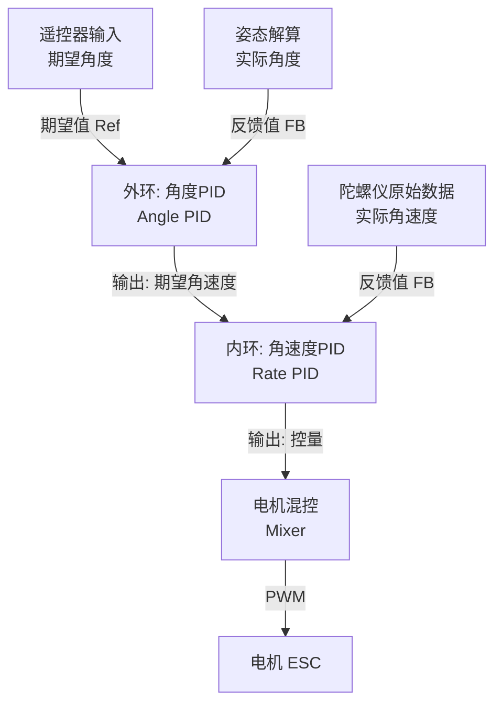

# STM32飞控 PID控制系统详解

本文档详细介绍了本项目（Flighter）的PID控制部分，涵盖整体结构、核心算法、关键变量说明及具体实现步骤。

## 1. 整体结构与控制流

本项目采用经典的**串级PID（Cascade PID）**控制架构，分为**外环（角度环/Position Loop）**和**内环（角速度环/Rate Loop）**。

### 1.1 控制链路图

### 1.2 控制层级

1. **外环（角度环）**：
   
   * **输入**：遥控器设定的期望欧拉角（Roll/Pitch） vs 姿态解算得到的实际欧拉角。
   * **输出**：期望的角速度（Rate Setpoint）。
   * **频率**：与姿态解算同频（通常较低或相同）。
   * **作用**：使飞机保持稳定的姿态角度。

2. **内环（角速度环）**：
   
   * **输入**：外环输出的期望角速度 vs 陀螺仪直接测量的实际角速度。
   * **输出**：电机油门调整量。
   * **频率**：通常较高（本项目中均为同频处理）。
   * **作用**：抵抗干扰，使飞机快速响应旋转指令，负责系统的动态稳定性。

> **注意**：Yaw（偏航）轴通常设计为单环或类似结构，输入直接控制角速度，停止操纵时锁定角度。

## 2. 算法架构 (PID Core)

本项目使用的是改进型的PID算法，主要实现在 `User/PID/pid.c` 中。

### 2.1 核心公式

采用标准位置式PID，但在微分项（D项）处理上有特殊优化。

$$ Output = P_{term} + I_{term} + D_{term} + FF_{term} $$

### 2.2 关键特性

1. **微分先行 (Derivative on Measurement)**：
   
   * 代码逻辑：`pid->deriv = -(measured - pid->prevMeasured) / dt`
   * **意义**：对“测量值”求导而不是对“误差”求导。这避免了设定点（Desired）突变（如猛推摇杆）时引起的“微分冲击（Derivative Kick）”，使系统响应更平滑。

2. **积分抗饱和 (Anti-Windup)**：
   
   * 代码逻辑：`constrain(integCandidate, -pid->iLimit, pid->iLimit)`
   * **意义**：当误差长期存在（如电机已满转速但仍无法达到目标）时，限制积分项的无限累加，防止误差消失后系统产生巨大的超调。
   * **扩展**：代码中还实现了动态积分冻结：当总输出达到 `outputLimit` 且误差方向将使输出继续增大时，停止积分累加。

3. **D项低通滤波 (D-Term Filter)**：
   
   * 代码逻辑：`lpf2pApply(&pid->dFilter, delta / pid->dt)`
   * **意义**：微分项对高频噪声非常敏感（特别是震动大的无人机环境）。通过二阶低通滤波器（LPF2）处理微分数据，减少高频震动直接传递给电机，防止电机发热。

## 3. 各变量与函数意义

### 3.1 核心结构体 `PidObject` (pid.h)

| 变量名              | 类型     | 意义          | 备注                        |
|:---------------- |:------ |:----------- |:------------------------- |
| `desired`        | float  | **设定点/目标值** | 如期望的滚转角 (30度)             |
| `error`          | float  | **误差**      | Desired - Measured        |
| `prevMeasured`   | float  | **上次测量值**   | 用于计算微分 (D-on-Measurement) |
| `integ`          | float  | **积分累加值**   | 历史误差之和                    |
| `kp`, `ki`, `kd` | float  | **PID增益**   | 比例、积分、微分系数                |
| `kff`            | float  | **前馈增益**    | 目前未使用，用于模型预测补偿            |
| `iLimit`         | float  | **积分限幅**    | 防止积分饱和                    |
| `outputLimit`    | float  | **总输出限幅**   | 防止PID输出超出执行器范围            |
| `dt`             | float  | **控制周期**    | 采样时间间隔 (s)                |
| `dFilter`        | struct | **D项滤波器**   | 二阶低通滤波器状态数据               |

### 3.2 控制器结构体 `AttitudeController_t` (AttitudeControl.h)

该结构体是飞行控制的顶层对象，包含了5个独立的PID控制器。

| 成员对象                                         | 意义       | 作用域              |
|:-------------------------------------------- |:-------- |:---------------- |
| `rollAnglePid`                               | 横滚角PID   | **外环**：控制左右倾斜角度  |
| `pitchAnglePid`                              | 俯仰角PID   | **外环**：控制前后倾斜角度  |
| `rollRatePid`                                | 横滚角速度PID | **内环**：控制左右旋转速率  |
| `pitchRatePid`                               | 俯仰角速度PID | **内环**：控制前后旋转速率  |
| `yawRatePid`                                 | 偏航角速度PID | **单环**：控制水平自旋速率  |
| `rollRateSp` `pitchRateSp` `yawRateSp` | 角速度设定点   | 连接外环输出与内环输入的中间变量 |

### 3.3 关键函数说明

1. **`pidInit(...)`**
   
   * **位置**：`User/PID/pid.c`
   * **功能**：初始化PID对象，清空积分/微分历史，设定PID参数(KP/KI/KD)及滤波器参数。

2. **`pidUpdate(...)`**
   
   * **位置**：`User/PID/pid.c`
   * **功能**：即时计算一次PID输出。
   * **实现步骤**：
     1. 计算误差 `error = desired - measured`。
     2. 处理Yaw轴的角度跳变（跨越±180度）。
     3. 计算P项 `P = kp * error`。
     4. 计算D项（基于测量值变化率），并应用低通滤波。
     5. 计算I项，应用积分限幅。
     6. 求和得到Output，应用总输出限幅。
     7. 更新 `prevMeasured` 供下次使用。

3. **`AttitudeController_Update(...)`**
   
   * **位置**：`User/AttitudeControl.c`
   * **功能**：执行完整的串级控制逻辑。
   * **实现步骤**：
     1. **自稳模式 (Angle Mode)**:
        * 调用 `pidUpdate` 计算 `rollAnglePid` 和 `pitchAnglePid`。
        * 输出结果赋值给 `rollRateSp` 和 `pitchRateSp`（作为内环目标）。
     2. **特技模式 (Acro Mode)** (如果启用):
        * 直接将遥控器输入映射为 `rollRateSp` 和 `pitchRateSp`。
     3. **内环控制**:
        * 将 `rollRateSp` 等设定为Rate PID的 `desired`。
        * 调用 `pidUpdate` 计算 `rollRatePid`、`pitchRatePid`、`yawRatePid`。
        * 得到最终输出 `rollOut`, `pitchOut`, `yawOut`。

4. **`AttitudeEstimator_UpdateIMU(...)`**
   
   - **功能** ：仅使用IMU更新姿态 
     
     **完整的向量化流程总结**
   
   如果把上面的过程用向量公式连起来看，逻辑非常清晰：
   
   1. **测量与估计**：
      
      - 实际重力（由加速度计测得）：$\vec{a}$ 
      - 估计重力（由陀螺仪积分得到）：$\vec{v}_{est}$
   
   2. **误差计算**：
      
      $$
      \vec{e} = \vec{a} \times \vec{v}_{est}
      $$

（这个误差同时包含了**角度差的大小**和**旋转轴的方向**）

3. **修正陀螺仪**：
   
   $$
   \vec{\omega}*{corrected} = \vec{\omega}*{gyro} + K_p \vec{e} + K_i \int \vec{e} , dt
   $$

4. **更新姿态**：
   
   $$
   q_{new} = q + \frac{1}{2} q \otimes \vec{\omega}_{corrected} \, dt
   $$

（这个乘法在代码中被展开成了那四行加法）

**总结**

   这段代码的本质就是：**用两个向量的叉积，去寻找陀螺仪积分出来的“虚拟世界”与加速度计感知的“真实世界”之间的偏差，然后用这个偏差去修正陀螺仪，让虚拟世界向真实世界靠拢。**

5. **`AttitudeController_MixToMotor(...)`**
   
   * **位置**：`User/AttitudeControl.c`
   * **功能**：将PID输出混控为4个电机的PWM值。
   * **逻辑**：X型四轴混控算法
     * M1 (前左) = Throttle + Py + Rr + Y
     * M2 (前右) = Throttle + Py - Rr - Y
     * ... (符号取决于机架构型和电机转向)

## 4. 功能实现步骤 (How it runs)

系统运行在FreeRTOS任务 `FlightControl_Task` 中，周期性执行（如 500Hz, 2ms/次）。

### 步骤 1: 初始化

系统启动时调用 `AttitudeController_Init`。

* 分配内存。
* 调用 `pidInit` 初始化5个PID对象。
* 设置积分限幅（例如外环积分限幅小，内环积分限幅大）。
* 加载默认PID参数 (`PID_PROFILE_NORMAL`)。

### 步骤 2: 数据采集与解算

* 读取MPU6050/GY86传感器数据。
* `AttitudeEstimator_Update` 解算出当前姿态（`AttitudeState_t state`），包含 Roll, Pitch (角度) 和 RollRate, PitchRate (角速度)。

### 步骤 3: 目标生成

* 读取遥控器PPM信号。
* `AttitudeController_GenerateSetpoint` 将摇杆位置转换为目标角度（`AttitudeSetpoint_t sp`）。
  * 例如：摇杆打到最右 -> 目标 Roll = 30度。

### 步骤 4: 执行控制 (Update)

调用 `AttitudeController_Update(&g_controller, &sp, &state, ...)`：

1. **Roll轴外环**：`pidUpdate(rollAnglePid, desired=sp.roll, measured=state.roll)` -> 得到 `target_roll_rate`。
2. **Roll轴内环**：`pidUpdate(rollRatePid, desired=target_roll_rate, measured=state.rollRate)` -> 得到 `roll_output`。
3. Pitch, Yaw轴同理。

### 步骤 5: 电机输出

* 调用 `AttitudeController_MixToMotor`。
* 将 PID 输出值叠加到基础油门（Throttle）上。
* 将计算出的 4 个电机值写入定时器比较寄存器（PWM Generation）。

---

**文档版本**: 1.0 (自动生成)
**关联代码文件**: `User/FlightControl.c`, `User/AttitudeControl.c`, `User/PID/pid.c`
